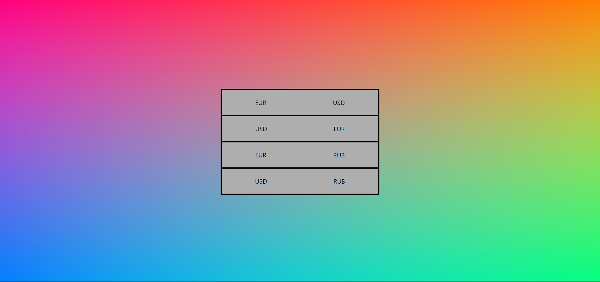
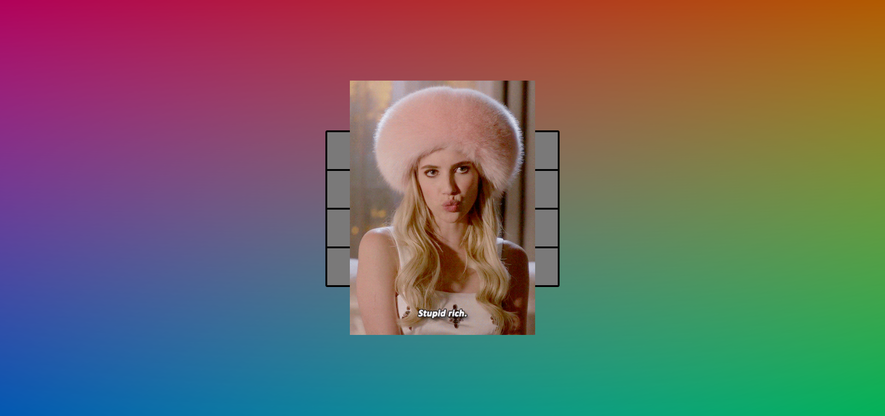

# tkinter rectangle-collision

[](https://github.com/qtenebrae/web-development/actions)
[](https://github.com/qtenebrae/web-developmen)

## Content

- [Preview](#preview)

- [Requirements](#requirements)

- [Main scripts](#main-scripts)

- [How to install](#how-to-install)

## Previews

The application displays gifs depending on the exchange rate of the selected currencies


Interface

The result of calling gifs

## Requirements

- Docker
- NodeJS

## Custom scripts

```bash
$ npm run get:dep #(Installs all dependencies for the project)
$ npm run build #(Builds the frontend and backend)
$ npm run backend #(Starts backend)
$ npm run frontend #(Starts frontend)
$ npm run backend:unit_tests #(Starts unit tests)
$ npm run backend:e2e_tests #(Starts e2e tests)
```

## How to install

After cloning the project repository, you need to go to the frontend folder and register the command in the terminal, it is necessary that the docker is launched

```bash
$ docker-compose up
```

Next, you need to go to the main repository folder and register the build and launch commands of the project

```bash
$ npm run get:dep
$ npm run build
$ npm run backend
$ npm run frontend
```
